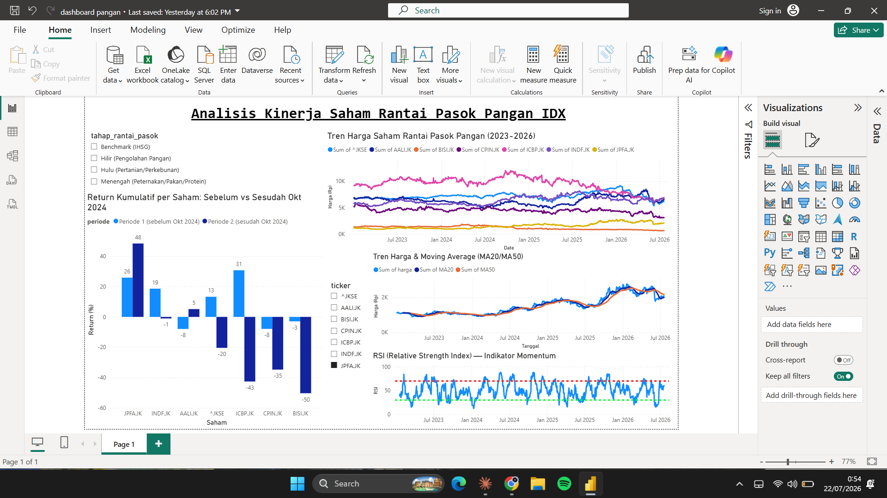

# Dampak Kebijakan Swasembada Pangan terhadap Kinerja Saham Rantai Pasok Pangan di IDX

Project analisis data untuk melihat bagaimana kinerja saham-saham di rantai pasok pangan (hulu, menengah, hilir) yang tercatat di Bursa Efek Indonesia (IDX), dalam konteks isu kebijakan swasembada pangan nasional.

## Latar Belakang

Swasembada pangan merupakan salah satu isu kebijakan ekonomi yang terus jadi perhatian di Indonesia. Sebagai negara agraris dengan pasar modal yang aktif, pergerakan kebijakan pangan berpotensi memengaruhi kinerja saham-saham di sektor terkait — mulai dari perusahaan perkebunan/pertanian (hulu), peternakan dan pakan ternak (menengah), hingga produsen makanan olahan (hilir).

Project ini lahir dari rasa penasaran sederhana: apakah isu swasembada pangan yang ramai dibicarakan itu benar-benar "kelihatan" di pergerakan saham-saham terkait? Jadi di sini saya coba bandingkan kinerja saham rantai pasok pangan pada dua periode observasi yang berbeda, sekaligus dibandingkan dengan kinerja pasar secara umum (IHSG).

## Pertanyaan Analisis

1. Bagaimana return dan volatilitas saham-saham rantai pasok pangan pada dua periode observasi (sebelum vs sesudah Oktober 2024)?
2. Apakah sektor pangan menunjukkan kinerja yang berbeda dari pergerakan IHSG secara umum?
3. Tahap rantai pasok mana (hulu, menengah, hilir) yang menunjukkan performa paling stabil/menguntungkan?

## Ruang Lingkup Saham

| Tahap Rantai Pasok | Saham | Keterangan |
|---|---|---|
| Hulu (Pertanian/Perkebunan) | AALI, BISI | Produsen sawit & benih pertanian |
| Menengah (Peternakan/Pakan/Protein) | CPIN, JPFA | Produsen unggas & pakan ternak |
| Hilir (Pengolahan Pangan) | ICBP, INDF | Produsen makanan olahan |
| Benchmark | ^JKSE (IHSG) | Pembanding kinerja pasar umum |

Periode data yang dipakai: **Januari 2023 – sekarang**, dibagi menjadi dua periode observasi dengan titik pembagi **Oktober 2024**.

## Tools & Teknologi

- **Python** (pandas, yfinance) — pengambilan & pengolahan data
- **SQL/SQLite** *(opsional)* — query & penyimpanan data terstruktur
- **Power BI / Tableau Public** — visualisasi dan dashboard

## Cara Menjalankan

1. Install dependency-nya dulu:
   ```bash
   pip install yfinance pandas
   ```
2. Lalu jalankan script pengambilan data:
   ```bash
   python analisis_swasembada_pangan.py
   ```
3. Kalau lancar, script akan menghasilkan 4 file CSV:
   - `harga_saham_pangan.csv` — harga historis tiap saham
   - `return_harian_pangan.csv` — return harian tiap saham
   - `ringkasan_sektor_pangan.csv` — ringkasan return, volatilitas, dan return kumulatif per tahap rantai pasok dan per periode
   - `indikator_teknikal_pangan.csv` — indikator analisis teknikal (MA20, MA50, RSI14) per saham per tanggal
4. Tinggal import `ringkasan_sektor_pangan.csv` dan `indikator_teknikal_pangan.csv` ke Power BI/Tableau untuk bikin dashboard-nya.

## Struktur File

```
├── analisis_swasembada_pangan.py     # script pengambilan & pengolahan data
├── harga_saham_pangan.csv            # output: harga historis
├── return_harian_pangan.csv          # output: return harian
├── ringkasan_sektor_pangan.csv       # output: ringkasan siap dashboard
├── indikator_teknikal_pangan.csv     # output: indikator teknikal (MA20, MA50, RSI14)
├── dashboard pangan.pbix             # file dashboard Power BI
├── dashboard_screenshot.png          # screenshot dashboard
└── README.md
```

## Indikator Analisis Teknikal

Selain analisis return & volatilitas, saya juga menambahkan beberapa indikator analisis teknikal standar untuk tiap saham (dan IHSG), supaya dashboard-nya bisa menampilkan tren harga dengan lebih detail — bukan cuma angka ringkasan per periode.

- **MA20 (Moving Average 20 hari)** — rata-rata harga penutupan 20 hari terakhir, menggambarkan tren jangka pendek.
- **MA50 (Moving Average 50 hari)** — rata-rata harga penutupan 50 hari terakhir, menggambarkan tren jangka menengah. Persilangan MA20 terhadap MA50 (golden cross/death cross) bisa jadi sinyal perubahan tren.
- **RSI14 (Relative Strength Index, periode 14 hari)** — indikator momentum dengan skala 0-100. Secara umum, RSI di atas 70 menandakan kondisi *overbought* dan di bawah 30 menandakan kondisi *oversold*.

Ketiganya dihitung per saham per tanggal dan disimpan di `indikator_teknikal_pangan.csv`, siap dipakai sebagai visual tambahan (line chart harga + MA, atau gauge RSI) di dashboard.

> Perlu digarisbawahi: indikator teknikal di sini murni untuk pembelajaran/portofolio analisis data, bukan rekomendasi jual/beli saham.

## Dashboard

Dashboard-nya dibuat di Power BI (`dashboard pangan.pbix`), menggabungkan ringkasan return/volatilitas per periode dengan indikator teknikal (harga + MA20/MA50, serta RSI14) untuk tiap saham.



## 🐛 Kendala & Debugging

Dua bug yang cukup bikin bingung selama pengerjaan, siapa tahu berguna buat yang mengalami hal serupa:

**1. Power BI salah baca angka desimal dari CSV Python — jadi miliaran**

CSV yang dihasilkan Python pakai format desimal ala Amerika (titik sebagai pemisah desimal, misalnya `0.0757` untuk 7.57%). Masalahnya, Power BI di laptop saya default-nya pakai locale Indonesia, yang menganggap titik sebagai pemisah ribuan. Akibatnya angka return kumulatif yang seharusnya kecil malah membengkak jadi ratusan ribu bahkan miliaran saat diimpor — sempat bikin panik karena dikira ada kesalahan hitung di script Python-nya, padahal datanya sendiri sudah benar.

Fix-nya ternyata sederhana: saat import CSV di Power BI (Get Data → Text/CSV), ubah setting *locale/origin* ke "English (United States)" supaya titik tetap dibaca sebagai pemisah desimal sesuai format aslinya. Setelah itu angka langsung normal kembali.

**2. Kolom MultiIndex dari yfinance bikin mapping ticker ke tahap rantai pasok berantakan**

yfinance versi yang saya pakai ternyata mengembalikan dataframe dengan kolom MultiIndex (kombinasi nama atribut seperti "Close" dan ticker), bukan kolom flat biasa — meski cuma minta data satu ticker sekalipun. Kalau tidak ditangani, proses rename kolom ke nama ticker jadi tidak konsisten, dan waktu di-mapping ke dictionary `label_tahap` (penanda tahap rantai pasok: hulu/menengah/hilir), beberapa ticker jadi tidak ketemu — hasilnya beberapa saham malah tidak masuk kategori tahap rantai pasok mana pun di ringkasan akhir.

Solusinya: tambahkan pengecekan `isinstance(df.columns, pd.MultiIndex)` lalu flatten dengan `get_level_values(0)` sebelum kolom "Close" diambil dan di-rename. Bisa dilihat di fungsi `ambil_data()` pada `analisis_swasembada_pangan.py`. Setelah di-flatten, mapping ke tahap rantai pasok jadi konsisten lagi.

## 💡 Temuan Utama

- **JPFA konsisten unggul di kedua periode observasi** — return kumulatif JPFA tercatat +25,9% pada Periode 1 (sebelum Okt 2024) dan naik lagi menjadi +48,4% pada Periode 2 (sesudah Okt 2024), menjadikannya satu-satunya saham di daftar yang mencatat performa positif dan menguat di kedua periode.
- **ICBP dan BISI melemah tajam pasca Oktober 2024.** ICBP berbalik dari +30,7% (Periode 1) menjadi -42,6% (Periode 2), sementara BISI turun dari -2,9% menjadi -50,3% pada rentang yang sama — pembalikan tren yang cukup signifikan di kedua saham ini.
- Menariknya, tahap menengah (peternakan/pakan) justru menunjukkan performa paling beragam: JPFA menguat tajam, tapi CPIN malah melemah dari -7,9% menjadi -34,7%. Jadi performa di tahap ini kelihatannya lebih ditentukan oleh faktor spesifik masing-masing perusahaan, bukan tren sektor secara keseluruhan.
- Secara umum, sektor pangan melemah lebih dalam dibanding IHSG pada Periode 2 — IHSG turun -20,4% sementara mayoritas saham pangan (BISI, CPIN, ICBP) turun lebih dalam lagi, kecuali JPFA dan AALI yang justru menguat di periode yang sama.

## Catatan

Project ini dibuat untuk tujuan pembelajaran dan portofolio analisis data, bukan merupakan rekomendasi atau nasihat investasi.

## Author

_(Nama kamu)_ — dibuat sebagai bagian dari persiapan portofolio data analyst/data scientist.
