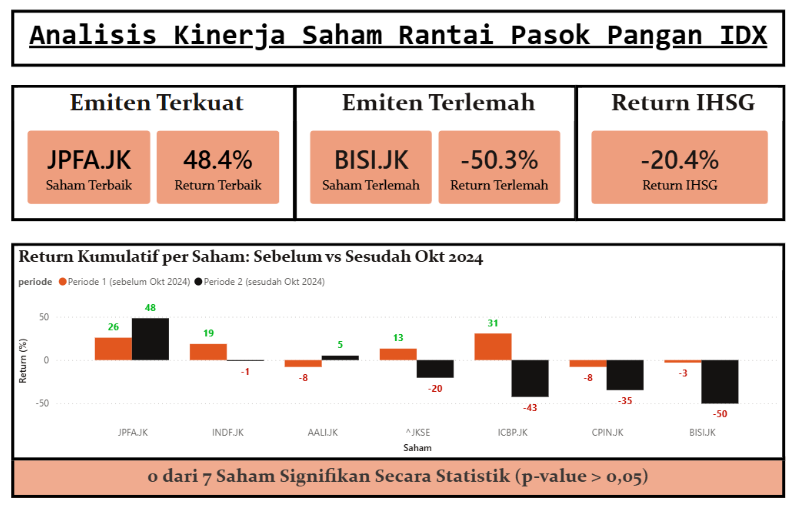
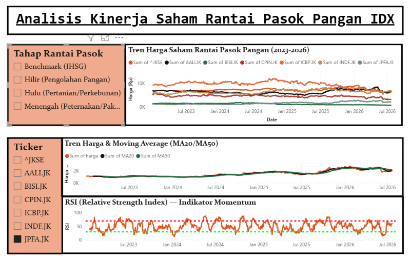

# Dampak Kebijakan Swasembada Pangan terhadap Kinerja Saham Rantai Pasok Pangan di IDX

Project analisis data untuk melihat bagaimana kinerja saham-saham di rantai pasok pangan (hulu, menengah, hilir) yang tercatat di Bursa Efek Indonesia (IDX), dalam konteks isu kebijakan swasembada pangan nasional.

## Daftar Isi

- [Latar Belakang](#latar-belakang)
- [Pertanyaan Analisis](#pertanyaan-analisis)
- [Ruang Lingkup Saham](#ruang-lingkup-saham)
- [Tools & Teknologi](#tools--teknologi)
- [Cara Menjalankan](#cara-menjalankan)
- [Struktur File](#struktur-file)
- [Indikator Analisis Teknikal](#indikator-analisis-teknikal)
- [Analisis SQL](#analisis-sql)
- [Uji Statistik & Regresi](#uji-statistik--regresi)
- [Dashboard](#dashboard)
- [Kendala & Debugging](#-kendala--debugging)
- [Temuan Utama](#-temuan-utama)
- [Catatan](#catatan)
- [Author](#author)

> 📓 **Mau lihat analisis paling lengkap?** Buka [`analisis_lanjutan.ipynb`](analisis_lanjutan.ipynb) — notebook ini melengkapi dashboard & query SQL dengan analisis statistik yang lebih dalam: heatmap korelasi antar saham, Sharpe Ratio, Max Drawdown, uji-t signifikansi perbedaan return antar periode, dan model forecasting return berbasis regresi linear.

## Latar Belakang

Swasembada pangan merupakan salah satu isu kebijakan ekonomi yang terus jadi perhatian di Indonesia. Sebagai negara agraris dengan pasar modal yang aktif, pergerakan kebijakan pangan berpotensi memengaruhi kinerja saham-saham di sektor terkait — mulai dari perusahaan perkebunan/pertanian (hulu), peternakan dan pakan ternak (menengah), hingga produsen makanan olahan (hilir).

Project ini lahir dari rasa penasaran sederhana: apakah isu swasembada pangan yang ramai dibicarakan itu benar-benar "kelihatan" di pergerakan saham-saham terkait? Jadi di sini saya coba bandingkan kinerja saham rantai pasok pangan pada dua periode observasi yang berbeda, sekaligus dibandingkan dengan kinerja pasar secara umum (IHSG).

## Pertanyaan Analisis

1. Bagaimana return dan volatilitas saham-saham rantai pasok pangan pada dua periode observasi (sebelum vs sesudah Oktober 2024)?
2. Apakah sektor pangan menunjukkan kinerja yang berbeda dari pergerakan IHSG secara umum?
3. Tahap rantai pasok mana (hulu, menengah, hilir) yang menunjukkan performa paling stabil/menguntungkan?
4. Apakah perbedaan return harian sebelum vs sesudah titik kebijakan (Okt 2024) signifikan secara statistik, dan bagaimana kualitas return-nya secara risk-adjusted (Sharpe ratio)?
5. Apakah makin dekat posisi sebuah saham ke hulu/hilir rantai pasok pangan berhubungan dengan besarnya return pasca titik kebijakan?

## Ruang Lingkup Saham

| Tahap Rantai Pasok | Saham | Keterangan |
|---|---|---|
| Hulu (Pertanian/Perkebunan) | AALI, BISI | Produsen sawit & benih pertanian |
| Menengah (Peternakan/Pakan/Protein) | CPIN, JPFA | Produsen unggas & pakan ternak |
| Hilir (Pengolahan Pangan) | ICBP, INDF | Produsen makanan olahan |
| Benchmark | ^JKSE (IHSG) | Pembanding kinerja pasar umum |

Periode data yang dipakai: **Januari 2023 – sekarang**, dibagi menjadi dua periode observasi dengan titik pembagi **Oktober 2024**.

## Tools & Teknologi

- **Python** (pandas, yfinance) — pengambilan & pengolahan data
- **SQL/SQLite** — query & penyimpanan data terstruktur (skema ternormalisasi)
- **scikit-learn, scipy** — model forecasting (regresi linear) dan uji statistik (uji-t, regresi)
- **seaborn** — visualisasi statistik (heatmap korelasi, dll.) di notebook
- **Jupyter Notebook** — analisis lanjutan interaktif (`analisis_lanjutan.ipynb`)
- **Power BI** — visualisasi dan dashboard

## Cara Menjalankan

1. Install dependency-nya dulu:
   ```bash
   pip install -r requirements.txt
   ```
2. Lalu jalankan script pengambilan data:
   ```bash
   python analisis_swasembada_pangan.py
   ```
3. Kalau lancar, script akan menghasilkan 4 file CSV:
   - `harga_saham_pangan.csv` — harga historis tiap saham
   - `return_harian_pangan.csv` — return harian tiap saham
   - `ringkasan_sektor_pangan.csv` — ringkasan return, volatilitas, dan return kumulatif per tahap rantai pasok dan per periode
   - `indikator_teknikal_pangan.csv` — indikator analisis teknikal (MA20, MA50, RSI14) per saham per tanggal
4. Tinggal import `ringkasan_sektor_pangan.csv` dan `indikator_teknikal_pangan.csv` ke Power BI untuk bikin dashboard-nya.
5. Untuk analisis SQL, bangun database SQLite-nya dari 4 CSV di atas:
   ```bash
   python buat_database.py
   ```
   Ini akan membuat `pangan.db` (skema ternormalisasi: `dim_saham` + 4 tabel fakta) dan langsung menjalankan 5 contoh query dari `queries.sql`.
6. Lanjutkan dengan uji statistik dan regresi (mengisi tabel `uji_statistik` dan `regresi_kebijakan` di `pangan.db`):
   ```bash
   python analisis_statistik.py
   python regresi_kebijakan.py
   ```
7. Untuk analisis lanjutan (korelasi, Sharpe Ratio, Max Drawdown, uji-t, forecasting), jalankan notebooknya:
   ```bash
   jupyter nbconvert --to notebook --execute --inplace analisis_lanjutan.ipynb
   ```

> Catatan kalau folder project ini disimpan di OneDrive: jalankan langkah 5-6 dari terminal biasa di laptop (bukan lewat automation/agent cloud yang mengakses folder lewat mount jaringan) — SQLite butuh file-locking yang biasanya tidak didukung mulus oleh mount OneDrive/jaringan, dan bisa muncul error `disk I/O error` kalau dipaksakan dari situ.

## Struktur File

```
├── analisis_swasembada_pangan.py     # script pengambilan & pengolahan data
├── harga_saham_pangan.csv            # output: harga historis
├── return_harian_pangan.csv          # output: return harian
├── ringkasan_sektor_pangan.csv       # output: ringkasan siap dashboard
├── indikator_teknikal_pangan.csv     # output: indikator teknikal (MA20, MA50, RSI14)
├── buat_database.py                  # script bangun database SQLite ternormalisasi dari 4 CSV di atas
├── queries.sql                       # 5 contoh query analisis SQL
├── pangan.db                         # database SQLite (dim_saham, harga_saham, return_harian, indikator_teknikal, ringkasan_sektor, uji_statistik, regresi_kebijakan)
├── analisis_statistik.py             # script uji-t (Welch) & Sharpe ratio per saham -> tabel uji_statistik
├── regresi_kebijakan.py              # script regresi linear (jarak rantai pasok vs return) -> tabel regresi_kebijakan
├── analisis_lanjutan.ipynb           # notebook analisis lanjutan (korelasi, Sharpe Ratio, Max Drawdown, uji-t, forecasting)
├── chart_return_kumulatif.png        # chart return kumulatif per ticker (untuk slide deck)
├── chart_excess_return_periode2.png  # chart excess return vs IHSG, Periode 2 (untuk slide deck)
├── chart_sharpe_ratio.png            # chart Sharpe Ratio per ticker (untuk slide deck)
├── buat_chart_return_kumulatif.py    # script pembuat chart_return_kumulatif.png
├── dashboard_pangan.pbix             # file dashboard Power BI
├── dashboard_screenshot_overview.png   # screenshot dashboard - halaman Ringkasan
├── dashboard_screenshot_teknikal.png   # screenshot dashboard - halaman Tren & Analisa Teknikal
├── requirements.txt                  # daftar dependency Python
├── LICENSE                           # lisensi MIT
├── .gitignore                        # file/folder yang diabaikan git
└── README.md
```

## Indikator Analisis Teknikal

Selain analisis return & volatilitas, saya juga menambahkan beberapa indikator analisis teknikal standar untuk tiap saham (dan IHSG), supaya dashboard-nya bisa menampilkan tren harga dengan lebih detail — bukan cuma angka ringkasan per periode.

- **MA20 (Moving Average 20 hari)** — rata-rata harga penutupan 20 hari terakhir, menggambarkan tren jangka pendek.
- **MA50 (Moving Average 50 hari)** — rata-rata harga penutupan 50 hari terakhir, menggambarkan tren jangka menengah. Persilangan MA20 terhadap MA50 (golden cross/death cross) bisa jadi sinyal perubahan tren.
- **RSI14 (Relative Strength Index, periode 14 hari)** — indikator momentum dengan skala 0-100. Secara umum, RSI di atas 70 menandakan kondisi *overbought* dan di bawah 30 menandakan kondisi *oversold*.

Ketiganya dihitung per saham per tanggal dan disimpan di `indikator_teknikal_pangan.csv`, siap dipakai sebagai visual tambahan (line chart harga + MA, atau gauge RSI) di dashboard.

> Perlu digarisbawahi: indikator teknikal di sini murni untuk pembelajaran/portofolio analisis data, bukan rekomendasi jual/beli saham.

## Analisis SQL

Selain dashboard Power BI, saya juga membuat database SQLite (`pangan.db`) dari 4 CSV hasil pengolahan data, dengan skema ternormalisasi (tabel dimensi `dim_saham` + tabel fakta), supaya bisa latihan sekaligus eksplorasi data pakai SQL murni. Database ini dibangun oleh script `buat_database.py`, yang juga langsung menjalankan 5 contoh query analisis dari `queries.sql`.

### Struktur Tabel

| Tabel | Kolom | Keterangan |
|---|---|---|
| `dim_saham` | ticker, tahap_rantai_pasok | Tabel dimensi: ticker -> tahap rantai pasok (hulu/menengah/hilir/benchmark) |
| `harga_saham` | tanggal, ticker, harga | Hasil ubah `harga_saham_pangan.csv` dari wide ke long format |
| `return_harian` | tanggal, ticker, return_harian | Hasil ubah `return_harian_pangan.csv` dari wide ke long format |
| `indikator_teknikal` | tanggal, ticker, ma20, ma50, rsi14 | Dari `indikator_teknikal_pangan.csv`, 1 baris per saham per tanggal |
| `ringkasan_sektor` | ticker, periode, rata_rata_return_harian, volatilitas, return_kumulatif | Dari `ringkasan_sektor_pangan.csv`, 1 baris per saham per periode |
| `uji_statistik` | ticker, p_value, hasil, sharpe_ratio | Hasil uji-t & Sharpe ratio per saham, diisi oleh `analisis_statistik.py` |
| `regresi_kebijakan` | variabel_x, variabel_y, n_sampel, slope, intercept, r_squared, p_value, std_error | Hasil regresi linear, diisi oleh `regresi_kebijakan.py` |

Semua tabel fakta punya `FOREIGN KEY (ticker) REFERENCES dim_saham(ticker)`, jadi `tahap_rantai_pasok` cukup disimpan sekali di `dim_saham` dan di-`JOIN` saat dibutuhkan, bukan diulang di tiap tabel.

Tabel `harga_saham` dan `return_harian` awalnya berbentuk wide (1 kolom per saham) di CSV, jadi perlu di-*melt* dulu ke long format supaya bisa di-`GROUP BY`/`JOIN` per ticker dengan wajar.

### 5 Query Analisis (`queries.sql`)

1. **Ranking saham per periode** — pakai window function `RANK() OVER (PARTITION BY periode ORDER BY return_kumulatif DESC)` untuk mengurutkan saham dari yang paling unggul ke paling tertinggal, tanpa perlu subquery terpisah per periode.
2. **Saham dengan volatilitas di atas rata-rata tahapnya** — pakai CTE (`WITH ...`) untuk hitung rata-rata volatilitas per tahap rantai pasok & periode, lalu di-`JOIN` balik ke data detail untuk cari saham yang di atas rata-rata "teman satu tahap"-nya.
3. **Deteksi golden cross / death cross** — pakai window function `LAG()` untuk membandingkan posisi MA20 vs MA50 hari ini dengan posisi hari sebelumnya, lalu `CASE WHEN` untuk menandai momen persilangan terjadi.
4. **Jumlah hari overbought vs oversold** — pakai conditional aggregation (`COUNT(CASE WHEN rsi14 > 70 THEN 1 END)`) untuk menghitung berapa hari tiap saham berada di zona RSI ekstrem.
5. **Perbandingan rata-rata return per tahap (Periode 1 vs 2)** — pakai self-JOIN pada tabel `ringkasan_sektor` untuk menjejerkan data Periode 1 dan Periode 2 dalam satu baris per tahap rantai pasok.

### Insight dari Query

- **Query 1** — JPFA.JK konsisten menempati peringkat 1 di kedua periode observasi (+25,9% di Periode 1, +48,4% di Periode 2), menegaskan lagi temuan dari analisis dashboard bahwa JPFA adalah satu-satunya saham yang menguat stabil di kedua periode.
- **Query 2** — JPFA.JK dan BISI.JK adalah dua saham yang paling volatil dibanding "teman satu tahap"-nya di kedua periode (JPFA di tahap menengah, BISI di tahap hulu), sementara ICBP dan INDF cuma muncul di salah satu periode saja.
- **Query 4** — Menariknya, yang paling sering overbought bukan saham individual, melainkan IHSG (^JKSE) sendiri — 122 dari 829 hari observasi, sedikit lebih sering dibanding JPFA.JK (113 hari) di posisi kedua.
- **Query 3** — Golden cross pada JPFA.JK muncul tanggal **28 Oktober 2024**, cuma 8 hari setelah titik pembagi periode (Oktober 2024) — sejalan dengan performa kuatnya sepanjang Periode 2. Di sisi lain, ada juga fase *whipsaw* (sinyal bolak-balik) pada JPFA.JK di Agustus–September 2023, dengan 6 pergantian sinyal golden/death cross hanya dalam rentang sekitar 2 minggu — tanda tren harga yang belum jelas arahnya di periode itu.

### Cara Menjalankan

```bash
python buat_database.py
```

Script ini akan membuat `pangan.db` dari 4 CSV yang ada, lalu langsung menjalankan dan mencetak hasil kelima query di `queries.sql`. Kalau mau eksplorasi manual atau bikin query sendiri, `pangan.db` juga bisa dibuka pakai [DB Browser for SQLite](https://sqlitebrowser.org/) *(opsional)* untuk eksplorasi visual tanpa perlu nulis Python.

## Uji Statistik & Regresi

Selain query SQL deskriptif, ada dua script tambahan yang mengisi database dengan hasil uji statistik formal — supaya klaim "signifikan"/"berpengaruh" di dashboard dan slide deck benar-benar bisa ditelusuri balik ke kode yang menghasilkannya, bukan cuma angka yang nongol di visual.

**`analisis_statistik.py`** — untuk tiap saham (termasuk IHSG), menjalankan **Welch's t-test** (`scipy.stats.ttest_ind`, `equal_var=False`) untuk membandingkan rata-rata return harian sebelum vs sesudah titik kebijakan (20 Oktober 2024), lalu menghitung **Sharpe ratio tahunan** dari return Periode 2. Hasilnya disimpan ke tabel `uji_statistik`.

**`regresi_kebijakan.py`** — menguji apakah posisi sebuah saham di rantai pasok pangan (hulu=1, menengah=2, hilir=3, IHSG dikeluarkan karena bukan bagian rantai pasok) berhubungan secara linear dengan besar return kumulatifnya di Periode 2, pakai `scipy.stats.linregress`. Hasilnya disimpan ke tabel `regresi_kebijakan`.

### Hasil

- **Uji-t**: p-value ketujuh saham/indeks semuanya di atas 0,05 ("H0 gagal ditolak") — artinya, walaupun beberapa saham (BISI, ICBP, CPIN) terlihat anjlok drastis di Periode 2, secara statistik perbedaan rata-rata return hariannya **belum cukup kuat untuk dibilang signifikan** dibanding fluktuasi normal saham itu sendiri. Sharpe ratio Periode 2 berkisar dari -1,10 (BISI, paling buruk) sampai +0,74 (JPFA, paling baik).
- **Regresi**: hasilnya **R² = 0,0001** dan **p-value = 0,986** (n = 6 saham) — praktis tidak ada hubungan linear antara posisi hulu/menengah/hilir dengan besar return Periode 2. Perlu digarisbawahi: ini uji dengan sampel sangat kecil (cuma 6 titik data, 1 per saham), jadi hasil non-signifikan ini lebih tepat dibaca sebagai "belum ada bukti hubungan linear sederhana dari data yang ada" — bukan kesimpulan kuat bahwa posisi rantai pasok tidak relevan sama sekali. Performa JPFA yang menonjol di Periode 2 kelihatannya lebih ditentukan faktor spesifik perusahaan (lihat bagian Temuan Utama) daripada pola posisi rantai pasok secara umum.

## Dashboard

Dashboard-nya dibuat di Power BI (`dashboard_pangan.pbix`), dipecah jadi 2 halaman: Ringkasan (KPI utama + return kumulatif per saham) dan Tren & Analisa Teknikal (harga + MA20/MA50, serta RSI14 per saham).

**Halaman Ringkasan**


**Halaman Tren & Analisa Teknikal** (contoh dengan ticker JPFA.JK dipilih)


## � Kendala & Debugging

Beberapa bug yang cukup bikin bingung selama pengerjaan, siapa tahu berguna buat yang mengalami hal serupa:

**1. Power BI salah baca angka desimal dari CSV Python — jadi miliaran**

CSV yang dihasilkan Python pakai format desimal ala Amerika (titik sebagai pemisah desimal, misalnya `0.0757` untuk 7.57%). Masalahnya, Power BI di laptop saya default-nya pakai locale Indonesia, yang menganggap titik sebagai pemisah ribuan. Akibatnya angka return kumulatif yang seharusnya kecil malah membenkak jadi ratusan ribu bahkan miliaran saat diimpor — sempat bikin panik karena dikira ada kesalahan hitung di script Python-nya, padahal datanya sendiri sudah benar.

Fix-nya ternyata sederhana: saat import CSV di Power BI (Get Data → Text/CSV), ubah setting *locale/origin* ke "English (United States)" supaya titik tetap dibaca sebagai pemisah desimal sesuai format aslinya. Setelah itu angka langsung normal kembali.

**2. Kolom MultiIndex dari yfinance bikin mapping ticker ke tahap rantai pasok berantakan**

yfinance versi yang saya pakai ternyata mengembalikan dataframe dengan kolom MultiIndex (kombinasi nama atribut seperti "Close" dan ticker), bukan kolom flat biasa — meski cuma minta data satu ticker sekalipun. Kalau tidak ditangani, proses rename kolom ke nama ticker jadi tidak konsisten, dan waktu di-mapping ke dictionary `label_tahap` (penanda tahap rantai pasok: hulu/menengah/hilir), beberapa ticker jadi tidak ketemu — hasilnya beberapa saham malah tidak masuk kategori tahap rantai pasok mana pun di ringkasan akhir.

Solusinya: tambahkan pengecekan `isinstance(df.columns, pd.MultiIndex)` lalu flatten dengan `get_level_values(0)` sebelum kolom "Close" diambil dan di-rename. Bisa dilihat di fungsi `ambil_data()` pada `analisis_swasembada_pangan.py`. Setelah di-flatten, mapping ke tahap rantai pasok jadi konsisten lagi.

**3. Karakter khusus rusak jadi `�` saat menulis teks lewat heredoc Bash di Windows**

Waktu mengisi teks markdown ke notebook (`analisis_lanjutan.ipynb`) lewat script Python yang dijalankan via heredoc di Git Bash (Windows), karakter khusus seperti en dash (–), em dash (—), kutip pintar (‘ dan ’), dan superscript (²) malah berubah jadi karakter pengganti `�` (U+FFFD) di file hasil akhir. Awalnya sempat terlihat baik-baik saja di layar, dan baru ketahuan setelah dicek ulang isi file-nya secara terprogram.

Penyebabnya: heredoc Bash di lingkungan Windows ini salah men-decode konten UTF-8 sebelum diteruskan ke Python, jadi karakter multi-byte di luar ASCII rusak duluan sebelum sempat ditulis ke file. Fix-nya: hindari heredoc untuk konten yang mengandung karakter non-ASCII — tulis script Python-nya sebagai file `.py` biasa terlebih dahulu (encoding UTF-8 dijamin oleh editor/tool penulis file), baru dijalankan. Setelah itu semua karakter khusus tersimpan utuh.

**4. SQLite `disk I/O error` saat database diakses lewat mount OneDrive/jaringan**

Saat membangun ulang `pangan.db` dari automation yang mengakses folder project lewat mount jaringan (bukan filesystem lokal langsung), `sqlite3.OperationalError: disk I/O error` muncul persis di langkah `CREATE TABLE` pertama — padahal skrip yang sama jalan mulus di filesystem lokal biasa. Penyebabnya: SQLite butuh mekanisme file-locking level OS yang tidak selalu didukung penuh oleh mount jaringan/cloud-sync seperti OneDrive.

Fix/workaround: bangun database di direktori lokal biasa dulu, baru salin file `.db` hasilnya ke folder project — proses *copy file* biasa tidak butuh file-locking seperti koneksi SQLite langsung, jadi aman dilakukan lewat mount jaringan. Untuk penggunaan sehari-hari, tetap disarankan menjalankan `buat_database.py`, `analisis_statistik.py`, dan `regresi_kebijakan.py` langsung dari terminal lokal di laptop.

## 💡 Temuan Utama

- **JPFA konsisten unggul di kedua periode observasi** — return kumulatif JPFA tercatat +25,9% pada Periode 1 (sebelum Okt 2024) dan naik lagi menjadi +48,4% pada Periode 2 (sesudah Okt 2024), menjadikannya satu-satunya saham di daftar yang mencatat performa positif dan menguat di kedua periode.
- **ICBP dan BISI melemah tajam pasca Oktober 2024.** ICBP berbalik dari +30,7% (Periode 1) menjadi -42,6% (Periode 2), sementara BISI turun dari -2,9% menjadi -50,3% pada rentang yang sama — pembalikan tren yang cukup signifikan di kedua saham ini.
- Menariknya, tahap menengah (peternakan/pakan) justru menunjukkan performa paling beragam: JPFA menguat tajam, tapi CPIN malah melemah dari -7,9% menjadi -34,7%. Jadi performa di tahap ini kelihatannya lebih ditentukan oleh faktor spesifik masing-masing perusahaan, bukan tren sektor secara keseluruhan.
- Secara umum, sektor pangan melemah lebih dalam dibanding IHSG pada Periode 2 — IHSG turun -20,4% sementara mayoritas saham pangan (BISI, CPIN, ICBP) turun lebih dalam lagi, kecuali JPFA dan AALI yang justru menguat di periode yang sama.
- **Tapi secara statistik, pergerakan-pergerakan besar ini belum terbukti signifikan.** Uji-t Welch untuk ketujuh saham/indeks semuanya menghasilkan p-value > 0,05 — jadi walau angkanya kelihatan dramatis di permukaan, itu belum cukup kuat dibedakan dari fluktuasi normal saham itu sendiri secara statistik. Begitu juga regresi posisi rantai pasok (hulu/menengah/hilir) terhadap return Periode 2 tidak menunjukkan hubungan linear yang berarti (R² = 0,0001, p = 0,986, n = 6) — sinyal bahwa performa tiap saham lebih didorong faktor spesifik perusahaan (lihat poin JPFA vs CPIN di atas) daripada posisi rantai pasoknya semata. Ini jadi pengingat penting soal batas generalisasi dari data harga saham jangka pendek dan sampel yang kecil.

## Catatan

Project ini dibuat untuk tujuan pembelajaran dan portofolio analisis data, bukan merupakan rekomendasi atau nasihat investasi.

## Author

**Samuel Geraldo Tobia Lumika** — dibuat sebagai bagian dari persiapan portofolio data analyst/data scientist.
